# Challenge DIO: Criar Imagens e Reconhecer texto em Imagens utilizando o Microsoft Copilot

## Criando Imagens:

- Input 1:

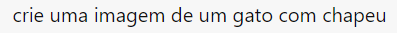

- Output 1:

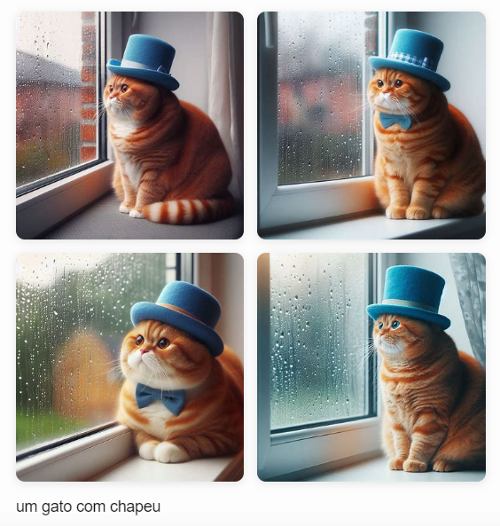

 

- Input 2:

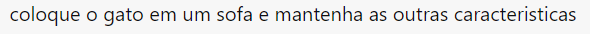

- Output 2:

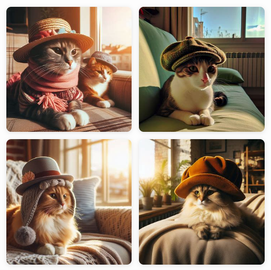

 

- Input 3:

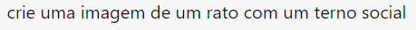

- Output 3:

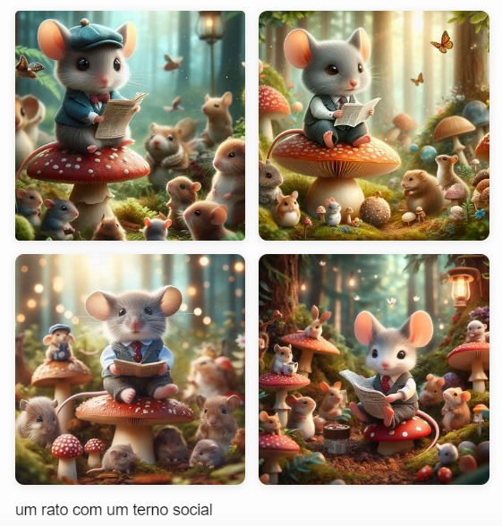

 

- Todas as imagens foram geradas utilizando a versão CRIATIVA do Microsoft Copilot IA.

## Reconhecendo Texto em Imagens:

- Input 1:

- Output 1:

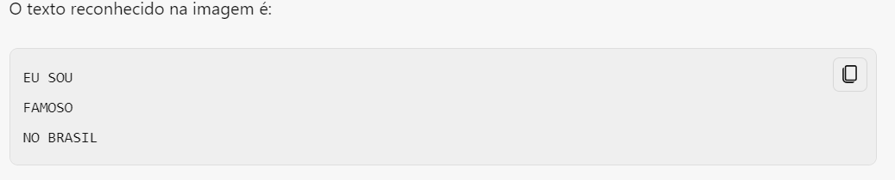

 

- Input 2:

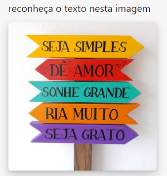

- Output 2:

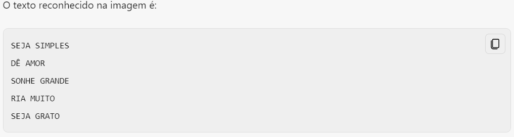

 

- Input 3:

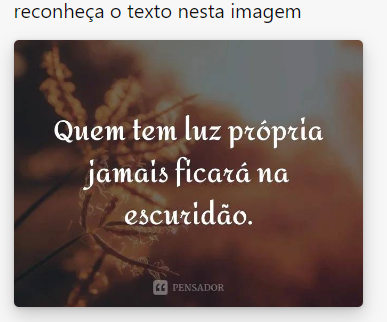

- Output 3:

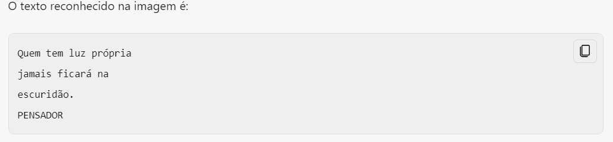

 
